```mermaid
flowchart TD
    A[🚀 Start] --> B[📂 User opens Streamlit App]
    B --> C[🔐 handle_auth]
    C --> D[🪪 Get token from session_state]
    D --> E[📥 get_current_user_data token]
    E --> F[📤 Extract role and preferences]
    F --> G[📚 render_sidebar role and prefs]
    G --> H{🧭 Role?}
    
    H --> I1[🧑‍🚀 Startup Founder → switch_page founder_dashboard]
    H --> I2[📊 Analyst → switch_page analyst_dashboard]
    H --> I3[🔬 Researcher → switch_page researcher_dashboard]
    
    I1 --> Z[✅ Dashboard Loaded]
    I2 --> Z
    I3 --> Z


```

```mermaid

flowchart TD
    A[🔐 Login via Main App] --> B{🔍 Role?}
    B -->|🧑‍🚀 Founder| C[🔄 switch_page founder_dashboard]
    C --> D[🧭 show_founder_dashboard]

    D --> E[📧 Load user_email]
    E -->|❌ Missing| X[🚫 Show error + stop]
    E -->|✅ Exists| F[⚙️ Load user preferences]

    F --> G[📚 render_sidebar]
    G --> H[📰 show_news_section]
    G --> I[💰 show_funding_section]
    G --> J[📝 show_preferences_form]

    J -->|📨 User submits| K[💾 save_founder_prefs]
    K --> L[🔁 st.rerun]


```

```mermaid

graph TD
    A[🔐 Login] --> B{🔍 Role?}
    B -->|Analyst| C[📊 Analyst Dashboard]

    C --> D[📥 Load Analyst Preferences]
    D --> E[📊 KPI Tracking Section]
    E --> F[📉 Trend Detection Section]
    F --> G[🛠 News Fetch & Summarizer]
    G --> H[🔍 Insight Explorer LLM]
    H --> I[⚠️ Anomaly Detection]
    I --> J[⚙️ Preferences Form]

    E -->|Fetch KPIs| E1[📈 Stock Data API]
    E -->|Save Snapshots| E2[📝 Database]

    F -->|Detect Movement| F1[🧠 Trend Summary LLM]

    G -->|Fetch News| G1[🌐 NewsAPI / Web]
    G -->|Summarize| G2[🧠 Article Summarizer]

    H -->|Ask Insight| H1[🧠 generate_insight_summary]

    I -->|Load History| I1[📂 load_kpi_history]
    I -->|Detect Outliers| I2[⚠️ detect_anomalies_for_ticker]

    J -->|Save Preferences| J1[💾 save_analyst_prefs]


```

```mermaid

graph TD
    A[🔐 Login] --> B{🔍 Role?}
    B -->|Researcher| C[🔬 Researcher Dashboard]

    C --> D[📥 Load Researcher Preferences]
    D --> E[🏢 Company Deep Dive Section]
    E --> F[📊 Peer Comparison Section]
    F --> G[🤖 Analyst Summary Generator]
    E --> H{Depth of Analysis}
    H -->|Deep| I[🧭 Industry Benchmarks Section]
    C --> J[⚙️ Researcher Preferences Form]

    E -->|Run Deep Dive| E1[🧠 company_deep_dive]
    F -->|Fetch Peers| F1[📈 get_peer_comparison]
    F -->|Chart Peers| F2[📊 plotly_bar_chart]
    G -->|Generate Insight| G1[🧠 generate_peer_comparison_insight]

    I -->|Show Benchmarks| I1[📉 compute_industry_benchmarks]
    I -->|Format Output| I2[📋 Company vs Peer Median]

    J -->|Save Preferences| J1[💾 save_researcher_prefs]

```

# 📊 BizIntel: Agentic AI for Market Intelligence

**BizIntel** is an agentic AI platform that autonomously collects, summarizes, and visualizes market insights to support strategic business decision-making.

Built with **LangGraph**, **LangChain**, **LlamaIndex**, **OpenAI**, **FastAPI**, and **Streamlit**, BizIntel delivers a personalized and extensible experience that makes market analysis faster, smarter, and more accessible.

---

## 🎯 Goals & Objectives

| Goal                     | Description                                                                 |
|--------------------------|-----------------------------------------------------------------------------|
| Autonomous Market Analysis | Automate collection and synthesis of market data and insights              |
| Actionable Visualization | Present insights via interactive, user-friendly visualizations              |
| Personalization          | Tailor insights and recommendations to individual user profiles             |
| Extensible Agent Library | Enable easy addition of new data sources and analysis agents                |

---

## ⚙️ Core Features

| Feature               | Description                                                                 |
|------------------------|-----------------------------------------------------------------------------|
| Data Collection Agents | Autonomous agents gather data from the web, APIs, and financial documents   |
| Summarization Engine   | Leverages OpenAI LLMs to produce concise, relevant market summaries         |
| Visualization Module   | Interactive dashboards built with Streamlit                                 |
| User Personalization   | Profiles, saved queries, and preferences for tailored insights               |
| Agent Library          | Modular, extensible agent framework using LangGraph        |
| API Layer              | FastAPI backend for agent orchestration and data access                      |
| Authentication         | Secure user login and session management                                     |

---

## 👥 User Stories

| As a…            | I want to…                                     | So that…                                      |
|------------------|--------------------------------------------------|-----------------------------------------------|
| Startup Founder  | Receive daily market summaries                   | I can make informed business decisions         |
| Analyst          | Customize data sources and analysis parameters   | I get insights relevant to my interests        |
| Researcher       | Visualize trends and compare market segments     | I can identify opportunities and threats       |

---

## 🚀 Tech Stack

- **LLMs**: OpenAI GPT (via API)
- **Frameworks**: LangChain, LlamaIndex
- **Backend**: FastAPI
- **Frontend/UI**: Streamlit
- **Vector Storage**: FAISS
- **Data Sources**: EDGAR, Yahoo Finance, FMP, Web Scraping

---

